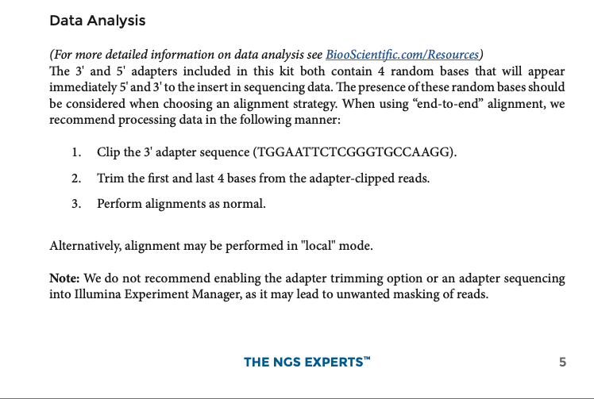

# Week 1

In this weeks tutorial you are tasked with installing `FastQC` & `MultiQC` quality control tools to assess the quality of sequencing data provided under `week1/data`.

Following quality control assessment, install `TrimGalore!` to perform adapter trimming and low quality read filtering. You will re-run `FastQC` and `MultiQC` to check if the adapter trimming was successful.

## Git housekeeping

### :warning: Do not try to push files larger than 20MB to GitHub :warning:

Make a clone of the GitHub repository `BarryDigby/MA5112` locally on your laptop:

```console
git clone git@github.com:BarryDigby/MA5112.git
```

Checkout a branch with the following naming convention: first character of your first name + surname. (e.g Barry Digby = bdigby )

```console
cd MA5112/
git checkout -b <your name>
git push -u origin <your name>
```

You will now have a copy of the `main` branch to work on for the tutorial. Each week, I will release new materials on the `main` branch. You can work on your own branch and incorporate these new additions using the following commands:

```console
git pull origin/main
```

This command essentially means "download the latest materials from the `main` branch to my branch". You will get the following error the first time you run this:

```console
From github.com:BarryDigby/MA5112
 * branch            main       -> FETCH_HEAD
hint: You have divergent branches and need to specify how to reconcile them.
hint: You can do so by running one of the following commands sometime before
hint: your next pull:
hint: 
hint:   git config pull.rebase false  # merge
hint:   git config pull.rebase true   # rebase
hint:   git config pull.ff only       # fast-forward only
hint: 
hint: You can replace "git config" with "git config --global" to set a default
hint: preference for all repositories. You can also pass --rebase, --no-rebase,
hint: or --ff-only on the command line to override the configured default per
hint: invocation.
fatal: Need to specify how to reconcile divergent branches.
```

What Git is saying is: The branch `main` has some new changes and you want to merge them, but your branch has changes too. How should I handle this?

We want to use `git config pull.rebase false` to accept the latest changes from `main` without overwriting your own work.

To recap: for week 2 when I release new materials, run the command `cd MA5112` and then `git pull origin/main` to synchronise the latest materials to your fork.

## Installing tools

Using `Anaconda` create an environment called `week1`:

```console
conda create -n week1
conda activate week1
```

Install the tools required for the practical:

```console
conda install -c bioconda fastqc multiqc trim-galore
```

Test that each tool was installed:

```console
fastqc --help
multiqc --help
trim_galore --help
```

## Quality Control

Use `FastQC` to perform quality control checks on each of the fastq files under `data/`. The expected outputs are a `*.html` and `*.zip` file per fastq file analysed.

- Check `fastqc --help` to view the expected inputs and flags.

- Execute `fastqc` over all fastq files in `data/` using a for loop.

Once this is done, run `multiqc .` in the directory with the `FastQC` outputs to consolidate them into a single HTML report `multiqc_report.html`.

We will inspect the output of the sequencing reports together during the tutorial.

## Adapter/Read Trimming

 

***

Perform adapter trimming on the raw sequencing data using `trim_galore`. To apply the suggestions from the supplier, use the following flags:

- `--adapter TGGAATTCTCGGGTGCCAAGG`: Specific adapter sequence to trim from the reads

- `--length 17`: Remaining reads must be of length 17. miRNA reads are within 17-25 in length

- `--clip_r1 4`: Remove the first 4 bases from the 5 prime end of R1.

- `-three_prime_clip_r1 4`: Remove the last 4 bases from the 3 prime end of R1.

- `--max_length 30`: Reject reads greater then length 30 after applying trimming.

- `--gzip`: Compress the output fastq file

***

Again, use a for loop to execute this on all fastq files in an efficient manner.

Re-use your code from the `Quality Control` step to generate reports of the **trimmed data**.

# Reproducible Analyses

In bioinformatics, GitHub is typically used to store code used for analyses. Over the past few years it has become increasingly common to store files capable of recapitulating the compute environment used at the time of analysis for 100% reproducibility (software versions etc are frozen).

## Conda `.yml` files

We can capture the commands used to create our conda environment using a `.yml` file:

> NB: Indentation is important for yaml files

Save the below information in a file called `environment.yml`:

```yaml
name: week1
channels:
  - bioconda
dependencies:
  - fastqc
  - multiqc
  - trim-galore
```

To re-create our week1 env on a different computer, run `conda env create -f environment.yml`.

You can request specific versions of tools by 'pinning' versions like so: `multiqc==1.14`. Be careful doing this, often there will be package conflicts that will take years off your life. In the `.yml` file given, no package versions are pinned thus Anaconda will find versions that run on (for example) the same version of python (2.7.18).

## Packing environments in containers

Using `Docker`, we will use a minimal image from `nf-core` that comes pre-packaged with `conda`. The idea here is to create a container holding our `week1` environment for portable execution.

- Go to Docker Hub and create a repository called `week1`

- Save the below information locally in a file called `Dockerfile`:

```Dockerfile
FROM nfcore/base:1.14

COPY environment.yml /
RUN conda env create -f /environment.yml

ENV PATH /opt/conda/envs/week1/bin/:$PATH
```

If you havent already, under `week1`, create a directory called `container`. Move the `Dockerfile` and `environment.yml` file there.

> N.B: substitute `$username` for your Docker Hub username

```console
cd container/
docker build -t $username/week1 .
docker push $username/week1
```

The container is now pushed to your Dockerhub account. You can pull the container from any computer with docker using `docker pull $username/week1`.

# Advanced

Write a bash script capable of performing:

- Adapter/Read trimming.

- FastQC of trimmed reads.

- MultiQC of trimmed FastQC reports.

Execute this bash script inside the Docker container.

### Shelling into Docker containers

To access the tools inside a docker container, use the interactive (`-it`) `run` command:

```console
docker run -it $username/week1
```

From here you can check if the tools were installed correctly (`fastqc --help`, `multiqc --help`, `trim_galore --help`).

Exit the container by typing `exit`.

### Docker volumes

We can load this weeks tutorial into the container using the `--volume / -v` parameter:

```console
docker run -it -v /MA5112/week1/:/files/ $username/week1
```

You can now view all tutorial files: `ls -la files/`. Make sure your bash script is in the directory!

***

Good luck