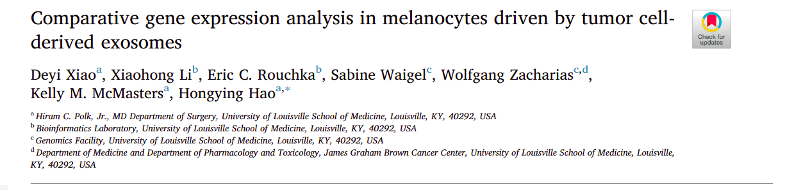

# RNA-Seq



A researcher has captured exosomes from human malignant melanoma cell line (A375) and the human lung cancer cell line (A549) and added them to primary human epidermal melanocytes (NHEM-c cells). There are triplicates of each cell line:

- NHEM-c (Control)
- NHEM-c + A549 exosomes (Lung)
- NHEM-c + A375 exosomes (Melanoma)

The researcher is interested in characterising the transcriptional profile of each transfected cell line, in an effort to elucidate the tumor pathways mediated by A375 & A549 tumor exosomes.

## Kallisto

Pseudo-alignment using Kallisto is relatively straight forward, requiring only two inputs:

- Reference transcriptome FASTA file

- Sequencing reads

The `kalliso` executable has been provided for you in the week4 github repository. Make it executable from any directory by adding it to your $PATH:

```bash
export PATH=$PATH:/data/github/MA5112/week4/
```

> Please update the above to reflect the directory where you have cloned the repository

### Dev testing

Develop scripts locally using small test datasets (fail fast) before deploying them on full size datasets. In the `toy_data` folder there are paired-end reads and a reference transcriptome for testing. You are tasked with writing a script to:

1. Index the reference transcriptome using `kallisto index`.

2. Align the reads to the reference transcriptome using `kallisto quant`.

Place these in a shell script and ensure it runs correctly before moving to the cluster.

### Cluster

The RNA-Seq dataset derived from cell lines is available on lugh. Log on using the masters student account:

```bash
ssh mscstudent@lugh.nuigalway.ie
```

Request a compute node - **please do not run commands on the head node**.

```bash
salloc -p MSC  -c1
```

Log on to the compute node:

```bash
ssh compute01
```

Navigate to your class directory:

```bash
cd /data/MSc/2023/
```

Please create a directory for yourself. The data is available at `/data/MSc/2023/rna_seq_dataset`. Similarly to your local script, use `kallisto index` to index the `Homo_sapiens.GRCh38.cdna.all.fa` file. Next, use `kallisto quant` to align each of the reads to the reference. In addition to the input FASTQ file , output directory and the reference index file, you will need to specify the following flags:

- `--single`: Indicate input is single-end reads (requires -l and -s)
- `-t 2`: threads to use
- `-l 200`: Estimated average fragment length
- `-s 30`: Estimated standard deviation of fragment length
- `--bias`: Perform sequence based bias correction


The main difference between your local script and script on lugh are the SLURM headers which specify compute resources for the job. Please use the following at the top of your script:

```console
#!/bin/sh

#SBATCH --job-name="Kallisto"
#SBATCH --output=Kallisto_%A.out
#SBATCH --partition MSC   # Queue name 
```

Submit the script to the SLURM scheduler by running `sbatch <scriptname>.sh`